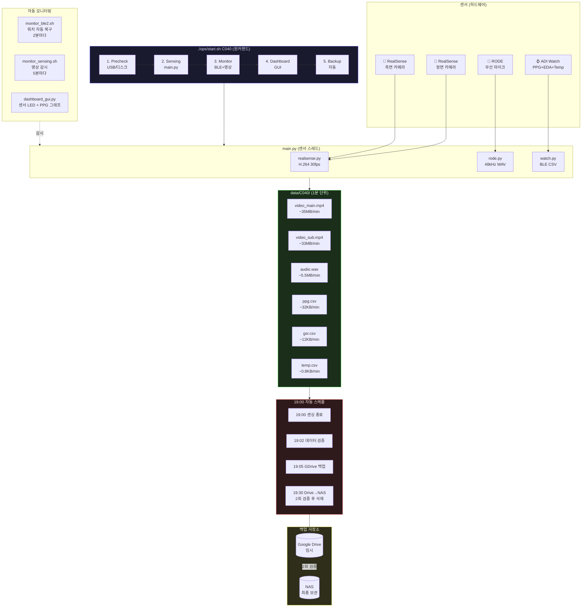
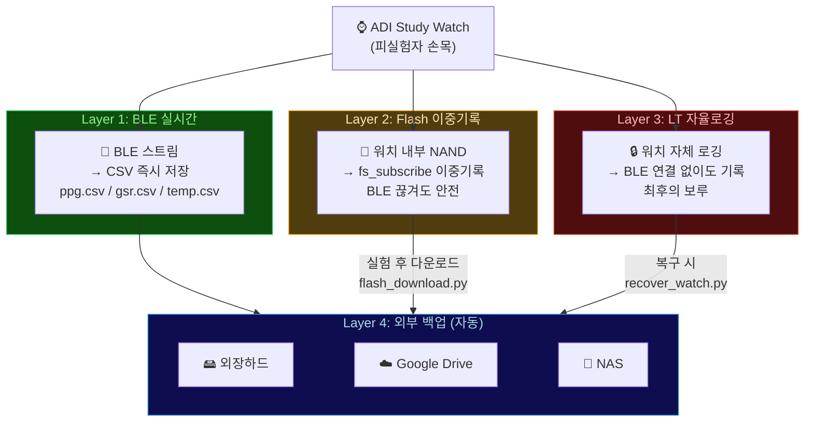
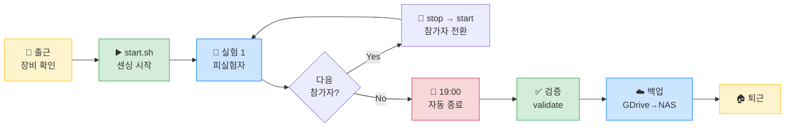
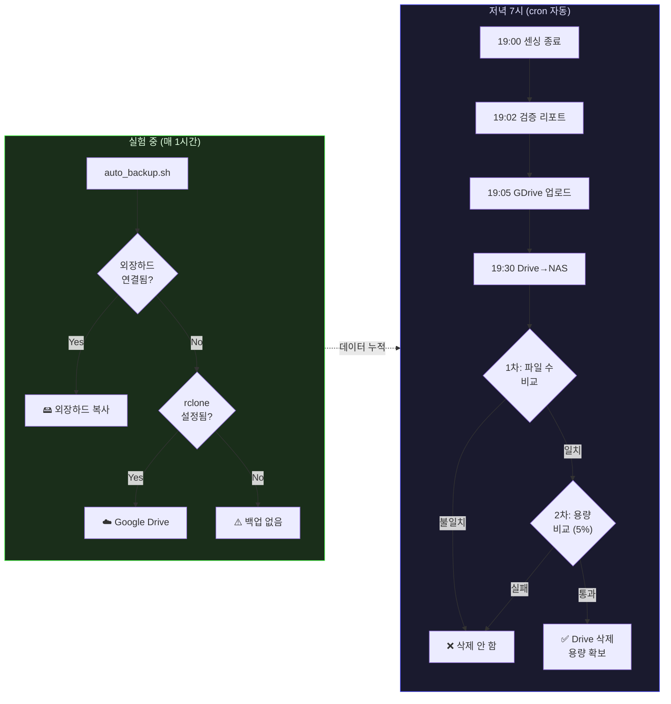

# Sensing Collector

**차량 시뮬레이터 피실험자 멀티모달 데이터 수집 시스템**

Jetson AGX Thor / Orin Nano에서 운전 시뮬레이션 실험 중 피실험자의 영상, 음성, 생체신호를 동시 수집하고, 자동 모니터링 + 백업 + 검증까지 원커맨드로 처리한다.

---

## 한줄 요약

> `./ops/start.sh C040` 하나로 센싱 + 모니터링 + 대시보드 + 백업이 전부 자동 실행. 저녁 7시에 자동 종료 + 검증 + Google Drive 백업 + NAS 전송.

---

## 전체 시스템 구조



---

## 데이터 보호 전략 (4중)



---

## 수집하는 데이터

| 센서 | 데이터 | 샘플레이트 | 파일 | 1분당 크기 |
|------|--------|-----------|------|-----------|
| RealSense D435 (정면) | 1920x1080 H.264 | 30fps | video_main.mp4 | ~35MB |
| RealSense D435 (측면) | 1920x1080 H.264 | 30fps | video_sub.mp4 | ~33MB |
| RODE Wireless GO II | 48kHz 모노 | 48000Hz | audio.wav | ~5.5MB |
| ADI Watch - PPG | 심박(광혈류) | 100Hz | ppg.csv | ~32KB |
| ADI Watch - EDA | 피부전도(GSR) | 30Hz | gsr.csv | ~12KB |
| ADI Watch - Temp | 피부온도 | 1Hz | temp.csv | ~0.8KB |

**1시간 = ~4.5GB, 하루 8시간 = ~36GB**

---

## 하루 실험 흐름



---

## 빠른 시작

### 최초 세팅 (한번만)

```bash
# 1. Thor/Orin에서 레포 클론
cd ~/Desktop
git clone https://github.com/RyanAhn533/sensing-collector.git
cd sensing-collector

# 2. Google Drive 연결
bash ops/setup_gdrive.sh

# 3. 자동 스케줄 등록 (매일 저녁 7시)
bash ops/setup_cron.sh
```

### 매일 실험

```bash
# 시작 (이것만 하면 전부 자동)
./ops/start.sh C040

# 실험 중: 대시보드가 자동으로 뜸. 아무것도 안 해도 됨.

# 종료 (저녁 7시에 자동. 수동으로 하려면:)
./ops/stop.sh

# 검증 (종료 후 반드시)
python3 validate/validate_session.py data/C040
```

### start.sh가 자동으로 하는 것

| 순서 | 작업 | 자동? |
|------|------|------|
| 1 | USB 장치 확인 (없으면 xhci 리셋) | O |
| 2 | 디스크 여유 확인 (10GB 미만이면 중단) | O |
| 3 | 동글 리셋 + 블루투스 끄기 | O |
| 4 | main.py 센싱 시작 | O |
| 5 | 35초 후 센서 검증 (v/a/ppg/gsr/temp) | O |
| 6 | BLE 모니터 시작 (워치 자동 복구) | O |
| 7 | GUI 대시보드 표시 | O |
| 8 | 자동 백업 (1시간마다) | O |

---

## 프로젝트 구조

```
sensing-collector/
│
├── config.json                 # 장비 설정 (시리얼번호, 경로, 임계값)
│
├── core/                       # 센서 드라이버
│   ├── main.py                 # 오케스트레이터 (모든 센서 스레드 관리)
│   ├── watch.py                # ADI Study Watch BLE (PPG/EDA/Temp)
│   ├── realsense.py            # RealSense D435 (GStreamer HW H.264)
│   ├── rode.py                 # RODE Wireless GO II (WAV)
│   └── rt_pub.py               # ZeroMQ 실시간 퍼블리셔
│
├── ops/                        # 운영 스크립트
│   ├── start.sh                # 원커맨드 시작 (precheck→sense→monitor→dashboard→backup)
│   ├── stop.sh                 # 안전 종료
│   ├── switch.sh               # 참가자 전환
│   ├── precheck.sh             # 장치 사전 체크
│   ├── auto_backup.sh          # 백그라운드 자동 백업 (외장하드/GDrive/NAS)
│   ├── setup_gdrive.sh         # Google Drive 연결 (rclone, 한번만)
│   ├── setup_cron.sh           # 매일 19:00 자동 스케줄 등록
│   ├── sync_gdrive_to_nas.py   # GDrive→NAS 전송 + 2회 검증 + Drive 정리
│   ├── daily_pipeline.sh       # 하루 전체 자동 운영
│   ├── schedule_example.sh     # 시간대별 스케줄 예시
│   ├── post_sensing.sh         # 종료 후 처리
│   ├── verify_copy.sh          # 백업 파일 검증
│   └── auto_sensing.py         # 자동 인원 감지 시작 (OpenCV)
│
├── monitor/                    # 실시간 모니터링
│   ├── dashboard_gui.py        # GUI 대시보드 (OpenCV, 모니터에 표시)
│   │                           #   센서 LED + PPG 그래프 + 디스크 바 + 알림
│   ├── dashboard.py            # 터미널 대시보드 (SSH용, ANSI 색상)
│   ├── monitor_ble2.sh         # 워치 BLE 감시 + 자동 재시작 (핵심!)
│   ├── monitor_sensing.sh      # 영상 감시 (5분마다)
│   ├── monitor.py              # 데이터 무결성 모니터
│   └── watchdog.sh             # 프로세스 워치독
│
├── validate/                   # 데이터 검증 (오프라인 가능!)
│   └── validate_session.py     # 세션 전체 검증
│       ├── MP4 moov atom 검사 (영상 finalize 확인)
│       ├── WAV 헤더 검사
│       ├── CSV 파싱 + 행수 확인
│       ├── 타임스탬프 연속성 (갭 감지)
│       └── PASS / PASS_WITH_WARNINGS / FAIL 판정
│
├── recovery/                   # 복구 도구
│   ├── flash_download.py       # 워치 Flash 데이터 다운로드
│   ├── recover_watch_data.py   # Flash → CSV 복원
│   ├── activate_lt.py          # LT 자율 로깅 활성화
│   ├── enable_lt_only.py       # LT Only 모드
│   ├── setup_lt_full.py        # LT 전체 세팅
│   ├── setup_lt_logging.py     # LT 로깅 설정
│   └── test_eda_now.py         # EDA 단독 테스트
│
├── dcb_cfg/                    # 워치 센서 설정 파일 (DCB)
│   ├── DVT1_MV_UC2_ADPD_dcb.dcfg
│   ├── DVT2_MV_UC2_ADPD_dcb.dcfg
│   └── lt_app_dcb.lcfg
│
└── docs/                       # 사용 설명서
    ├── 01_QUICK_START.md       # 5분 시작 가이드 (복붙 명령어)
    ├── 02_MONITORING.md        # 실험 중 확인법
    ├── 03_TROUBLESHOOTING.md   # 문제 해결 (인쇄용 카드 포함)
    ├── 04_DATA_VALIDATION.md   # 오프라인 검증 + Flash 교차검증
    ├── 05_HARDWARE_SETUP.md    # 장비 연결 다이어그램
    └── 06_DASHBOARD.md         # 대시보드 사용법
```

---

## 자동 백업 파이프라인



### Google Drive 세팅

```bash
# 한번만 실행
bash ops/setup_gdrive.sh
```

### NAS 동기화 (수동)

```bash
# 전체 세션 동기화
python3 ops/sync_gdrive_to_nas.py

# 특정 참가자만
python3 ops/sync_gdrive_to_nas.py --participant C040

# 삭제 안 하고 복사만
python3 ops/sync_gdrive_to_nas.py --no-delete

# 뭘 할지 미리 보기
python3 ops/sync_gdrive_to_nas.py --dry-run
```

---

## 실시간 대시보드

### GUI (모니터에 띄울 때)

```bash
python3 monitor/dashboard_gui.py
python3 monitor/dashboard_gui.py --fullscreen
```

| 키 | 기능 |
|----|------|
| ESC | 대시보드 종료 (센싱은 계속) |
| F | 풀스크린 토글 |
| S | 스크린샷 저장 |

### 터미널 (SSH)

```bash
python3 monitor/dashboard.py
```

---

## 알려진 이슈

| 이슈 | 원인 | 해결 | 자동? |
|------|------|------|------|
| USB 안 잡힘 | xhci 불안정 | start.sh가 자동 xhci 리셋 | O |
| GSR 안 나옴 | BLE 스케줄링 | Flash에 기록 중 → 실험 후 복구 | O |
| 워치 끊김 | BLE 연결 해제 | monitor_ble2.sh 자동 재연결 | O |
| 디스크 풀 | 데이터 누적 | start.sh가 10GB 미만이면 차단 | O |
| MP4 손상 | 비정상 종료 | .tmp→final atomic rename | O |
| 워치 슬립 | BLE 광고 중단 | 물리적 터치 필요 | X |

---

## 하드웨어

| 장비 | 모델 | 연결 |
|------|------|------|
| 메인 PC | Jetson AGX Thor (128GB) | 전원 + HDMI + 이더넷 |
| 카메라 (정면) | Intel RealSense D435 | USB 허브 |
| 카메라 (측면) | Intel RealSense D435 | USB 허브 |
| 마이크 | RODE Wireless GO II | USB 허브 (RX) |
| 워치 | ADI Study Watch | BLE 동글 → USB 허브 |
| USB 허브 | Realtek RTS5411 | **외부 전원 필수** |

---

## 문서 목록

| 문서 | 대상 | 내용 |
|------|------|------|
| [01_QUICK_START](docs/01_QUICK_START.md) | 처음 쓰는 사람 | 5분 가이드 |
| [02_MONITORING](docs/02_MONITORING.md) | 실험 중 | 센서 확인법 |
| [03_TROUBLESHOOTING](docs/03_TROUBLESHOOTING.md) | 문제 생겼을 때 | 인쇄용 카드 포함 |
| [04_DATA_VALIDATION](docs/04_DATA_VALIDATION.md) | 실험 후 | 오프라인 검증 |
| [05_HARDWARE_SETUP](docs/05_HARDWARE_SETUP.md) | 처음 세팅 | 연결 다이어그램 |
| [06_DASHBOARD](docs/06_DASHBOARD.md) | 모니터링 | GUI/터미널 대시보드 |

---

## 센서 시작 순서 (중요)

워치 센서는 반드시 이 순서로 시작해야 EDA(GSR)가 나옵니다:

```
1. EDA DFT 설정
2. ADPD DCB 로드
3. 센서 시작: ADPD(PPG) → Temperature → EDA
4. Subscribe:  ADPD → Temperature → EDA
5. Flash subscribe (이중기록)
```

이 순서는 `core/watch.py`에 구현되어 있습니다. 수동으로 바꾸지 마세요.

---

## 호환성

| 플랫폼 | 테스트 | 비고 |
|--------|--------|------|
| Jetson AGX Thor | O | 메인 타겟 |
| Jetson Orin Nano | O | xhci 경로만 다름 (config.json) |
| x86 Linux | - | GStreamer HW 인코딩 불가 (SW fallback 필요) |
